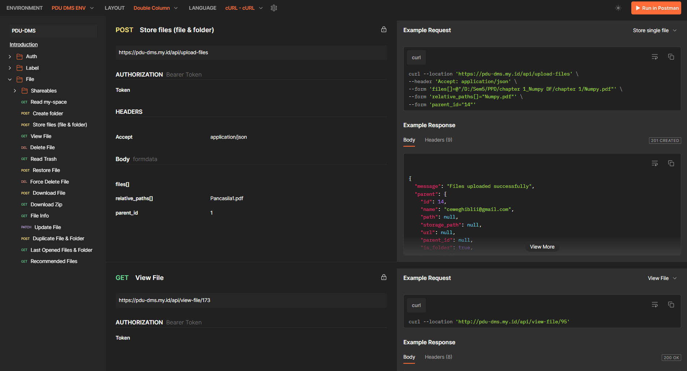
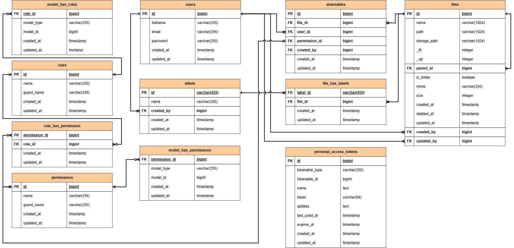
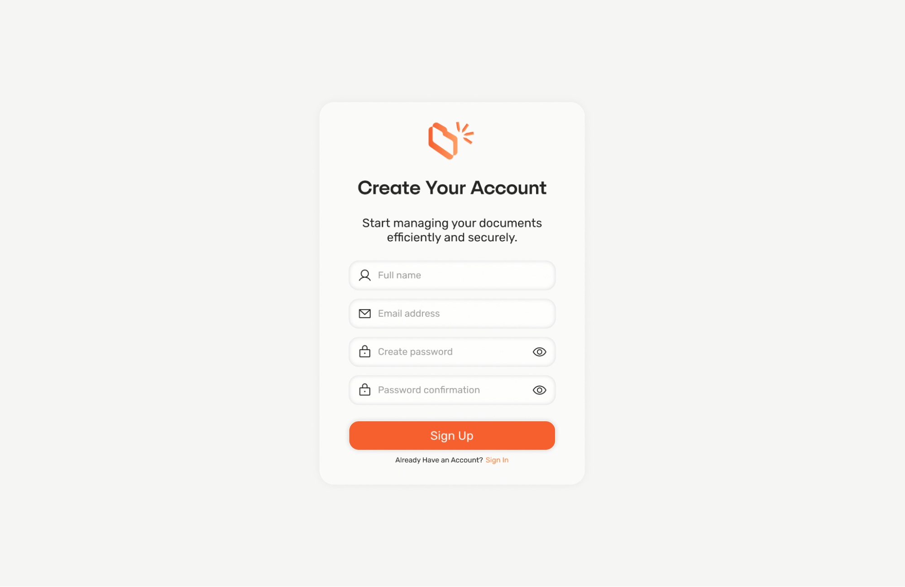
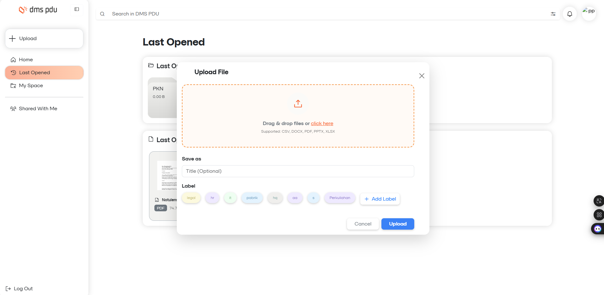
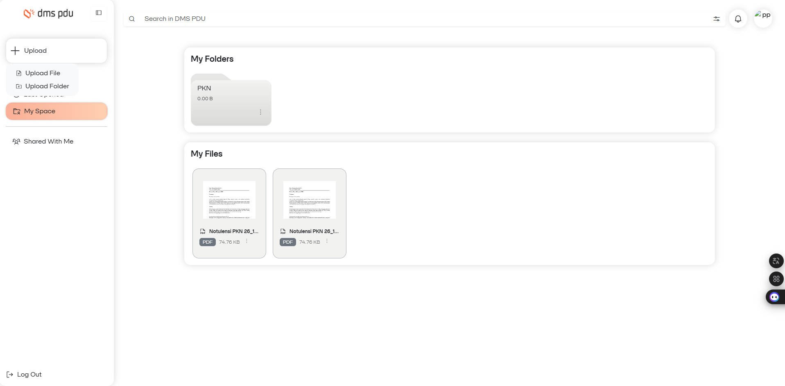

# Document Management System (DMS-PDU) Backend API

## Project Description

DMS-PDU is a comprehensive document management system designed for collaborative file storage, sharing, and organization. The system provides secure file management with features including hierarchical folder structures, advanced sharing capabilities with granular permissions, real-time notifications, file labeling, cloud storage integration, and intelligent file recommendations. Built with Laravel, it offers a robust API for managing documents in educational or organizational environments.

API Documentation: Available via Swagger UI at `/api/documentation` endpoint or via https://documenter.getpostman.com/view/48557365/2sB3QGurZV


ERD Design Document: https://docs.google.com/document/d/1_2ADXiHTwBbrRRX5IpRVJLz5RsCCvBNCKuewI2BfELY/edit?usp=sharing

*Entity Relationship Diagram Design*

## Frontend Interface


*Registration page for new users*


*File upload interface for document storage*


*User's personal document workspace showing all stored files*

## Tech Stack

- **PHP 8.2+** - Programming language
- **Laravel 12** - Web framework
- **Laravel Sanctum** - API authentication
- **MySQL** - Database
- **Spatie Laravel Permission** - Role and permission management
- **Laravel Reverb / Pusher** - Real-time notifications
- **Laravel Queue** - Background job processing
- **L5-Swagger** - API documentation
- **Composer** - Dependency management

## Project Structure

```
dms-pdu/
├── app/
│   ├── Events/           # Event classes (FileShared)
│   ├── Helpers/          # Helper utilities (FileHelper)
│   ├── Http/
│   │   ├── Controllers/  # API controllers
│   │   ├── Requests/     # Form request validation
│   │   └── Resources/    # API resources
│   ├── Jobs/             # Queue jobs (Cloud upload, file sharing)
│   ├── Listeners/        # Event listeners
│   ├── Mail/             # Email templates
│   ├── Models/           # Eloquent models
│   ├── Notifications/    # Notification classes
│   ├── Providers/        # Service providers
│   └── Traits/           # Reusable traits
├── config/               # Configuration files
├── database/
│   ├── migrations/       # Database migrations
│   └── seeders/          # Database seeders
├── routes/
│   └── api.php           # API routes
├── storage/
│   └── api-docs/         # Swagger documentation
├── .gitlab-ci.yml        # GitLab CI/CD pipeline
├── .env                  # Environment variables
└── composer.json         # PHP dependencies
```

## Installation

### Prerequisites

- PHP >= 8.2
- Composer
- MySQL

### Setup Instructions

1. Clone the repository

```bash
git clone https://github.com/annisa-ugm/dms-pdu.git
cd dms-pdu
```

2. Install dependencies

```bash
composer install
npm install
```

3. Configure environment variables

```bash
cp .env.example .env
```

Edit the `.env` file and set your configurations:
- Database credentials
- Mail server settings
- Broadcasting settings (Pusher/Reverb)

4. Generate application key

```bash
php artisan key:generate
```

5. Run database migrations and seeders

```bash
php artisan migrate:fresh --seed
```

6. Create storage link

```bash
php artisan storage:link
```

7. Start the development server

```bash
php artisan serve
```

This will concurrently start:
- Laravel development server at `http://127.0.0.1:8000`
- Queue worker

## Authentication

This API uses Laravel Sanctum for token-based authentication. Protected routes require an `Authorization: Bearer {token}` header.

### User Roles & Permissions

**System Roles:**
- **Super Admin** - Full system access including user management
- **Admin** - Can manage files, folders, labels, and share content
- **Guest** - View-only access
- **Receiver** - Can view and edit shared files

**Permissions:**
- File management: create, edit, delete, view, share
- Label management: create, edit, delete
- User management: assign admin roles and permissions

## Main Features

### File Management
Upload, download, view, update, delete, and duplicate files. Supports hierarchical folder structures with nested set model for efficient tree operations. Includes file versioning and access logging.

### Folder Organization
Create and manage nested folder structures. Navigate through folders with breadcrumb support. Move files between folders with drag-and-drop support (client-side implementation required).

### File Sharing
Share files with specific users via email with granular permissions (view-only or edit). Generate public share links with optional expiration dates. Track shared file access with detailed logs.

### Labels & Tags
Organize files with customizable color-coded labels. Filter files by multiple labels. Create, update, and delete labels with user-specific visibility.

### Search & Discovery
Search files by name with database-powered queries. Filter files by labels, folders, and metadata. Smart file recommendations based on usage patterns and access history.

### Recent & Recommended Files
Track last opened files for quick access. Get personalized file recommendations based on access frequency and recency.

### Trash & Recovery
Soft delete files with trash management. Restore deleted files with full history preservation. Permanently delete files with force delete functionality.

### Real-time Notifications
Instant notifications when files are shared. Track unread and read notifications. WebSocket support via Laravel Reverb or Pusher.

### Activity Logging
Comprehensive file access logging. Track who accessed what and when. Audit trail for compliance and security.

## API Endpoints

All endpoints are prefixed with `/api` and most require authentication except for login, registration, and public file sharing.

### Authentication
- `POST /register-user` - Register new user
- `POST /login-user` - Login and receive token
- `POST /logout-user` - Logout and revoke token
- `GET /email/verify/{id}/{hash}` - Verify email
- `POST /forgot-password` - Request password reset
- `POST /reset-password` - Reset password with token

### File Management
- `GET /my-files/{folderId?}` - List files and folders
- `POST /create-folder` - Create new folder
- `POST /upload-files` - Upload multiple files
- `PATCH /update-file/{fileId}` - Update file details
- `DELETE /delete-file/{fileId}` - Move file to trash
- `GET /view-file/{fileId}` - View file details
- `POST /download` - Download files
- `POST /duplicate-file` - Duplicate file
- `GET /file-info/{fileId}` - Get detailed file information

### Sharing
- `POST /share-file/{file_id}` - Share file with users
- `GET /shared-file/{file_id}` - View shared users
- `GET /shared-with-me` - Files shared with current user
- `PATCH /update-share/{share_id}` - Update sharing permissions
- `DELETE /remove-share/{share_id}` - Remove file sharing
- `GET /s/{token}` - Public file access via share link

### Labels
- `GET /labels` - List all labels
- `POST /create-label` - Create new label
- `PATCH /update-label/{labelId}` - Update label
- `DELETE /delete-label/{labelId}` - Delete label
- `GET /label/{labelId}` - Get files by label

### Trash
- `GET /trash` - List trashed files
- `POST /restore-file` - Restore file from trash
- `DELETE /force-delete-file` - Permanently delete file

### Recommendations
- `GET /recommended-files` - Get recommended files
- `GET /last-opened-files` - Get recently accessed files

### Notifications
- `GET /share-notifications` - All notifications
- `GET /share-notifications/unread` - Unread notifications
- `POST /share-notifications/mark-as-read/{id}` - Mark as read

### User Management
- `GET /users` - List all users
- `GET /search-users` - Search users by name/email
- `PATCH /update-profile` - Update user profile
- `POST /change-password` - Change password

For detailed endpoint documentation including request/response examples, refer to the API documentation link above.

## Database Seeding

The application includes seeders for development and testing:
- **PermissionSeeder**: Creates roles (superAdmin, admin, guest) and permissions
- **UserSeeder**: Creates test users with different roles
- **ShareRoleSeeder**: Creates sharing-specific roles (receiver)

## CI/CD Pipeline

The project includes GitLab CI/CD configuration with three stages:

### Build Stage
- Installs Composer dependencies
- Generates application key
- Creates artifacts for testing and deployment

### Test Stage
- Runs PHPUnit tests
- Sets up MySQL test database
- Executes migrations and seeders
- Validates application functionality

### Deploy Stage
- Deploys to VPS via SSH
- Creates database backups before deployment
- Runs migrations on production
- Optimizes application (cache routes, config, views)
- Restarts PHP-FPM and Nginx

## Notes

- All file paths use nested set model for efficient hierarchical queries
- Files are initially stored locally and asynchronously uploaded to server via queue jobs
- Share links are encrypted and can have expiration dates for security
- File access is logged for audit and recommendation purposes
- Real-time features require WebSocket server (Laravel Reverb or Pusher)
- File search uses database LIKE queries for name-based filtering
- All API responses follow consistent JSON structure with proper HTTP status codes
- CORS is configured to allow frontend integration
